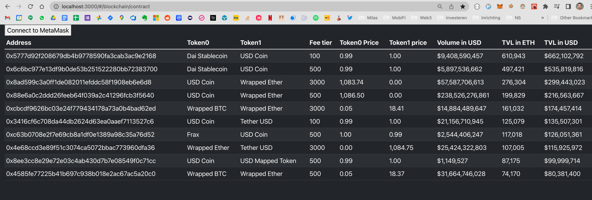

# Uniswap Explorer

React Web App that displays the 10 largest liquidity pools by **totalValueLockedUSD** and allows you to connect to 
the Ethereum Blockchain via MetaMask. It's a work in progress and for now it's mainly a learning-by-doing way for me to 
better understand React in general and building a front-end app that interfaces with Web3 in specific. 

Under the hood it:
- Uses [web3-react](https://github.com/NoahZinsmeister/web3-react) to easily connect to Web3 providers.
- Uses React hooks to fetch and cache data from Contracts and optimize performance using [SWR](https://swr.vercel.app)  
- Allows you to generate types for the contract ABIs using [TypeChain](https://github.com/ethereum-ts/TypeChain) in 
  the `./contracts` folder.
- Queries the [UniswapV3 subgraph](https://api.thegraph.com/subgraphs/name/uniswap/uniswap-v3) using GraphQL.
- Uses [HardHat](https://hardhat.org/) to compile, deploy and test Solidity smart contracts. It's also used to start 
  a local hardhat node as a fork of the Ethereum mainnet. You do this by executing `npx hardhat node`.

Many thanks to Jeff Reiner for making available his [next-web3-boilerplate](https://github.com/mirshko/next-web3-boilerplate)
project. It contained many valuable examples and was a great help to get off to a running start.

## Scripts

In the project directory, you can run:

### `npm run compile-contract-types`
This compiles the contract types for all the smart contract ABIs (JSON files) that are placed in the `./contracts` 
folder. 

### `npm start`

Runs the app in the development mode.\
Open [http://localhost:3000](http://localhost:3000) to view it in the browser.

When started up it should look something like:

### `npm test`

Launches the test runner in the interactive watch mode.\
See the section about [running tests](https://facebook.github.io/create-react-app/docs/running-tests) for more information.